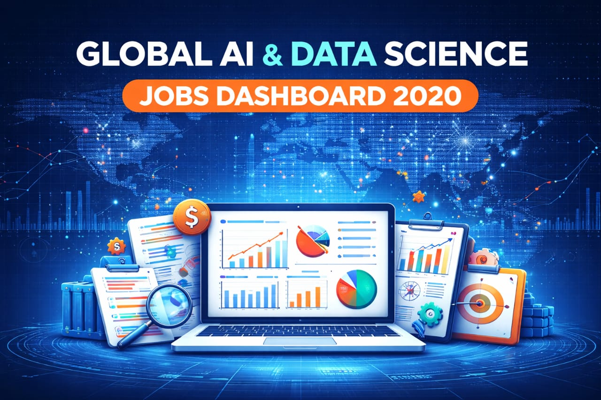
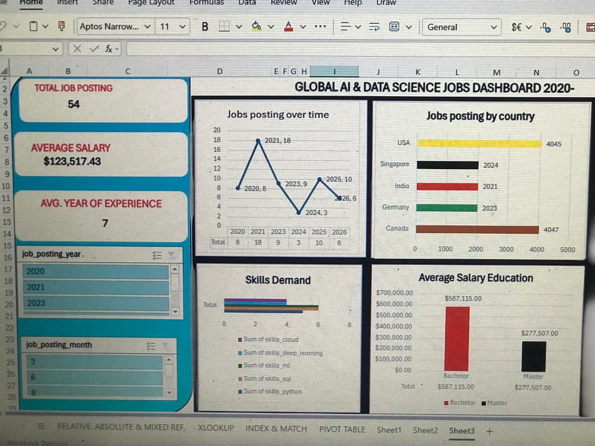

# Global AI & Data Science Job Market Analytics Dashboard (2020–2026)

---

##  Introduction
This project presents an interactive **Excel dashboard** that analyzes global trends in the AI and Data Science job market. It provides insights into job postings, salary distribution, required skills, and hiring urgency.

---

## Dataset
The dataset includes:
- Education Level  
- Skills (Python, SQL, ML, Deep Learning, Cloud)  
- Salary  
- Job Posting Month & Year  
- Hiring Urgency  
- Job Openings  

🔗 **Dataset Link:**  
https://1drv.ms/x/c/f729756d9dbf5534/IQBTFE9UsYnOS6UZA6l-vfxoAbJBFmZgS5OaqYvjX9F9hAc?e=kNqylx  

---

## 📊 Dashboard Preview

---

##  Tools Used
- Microsoft Excel  
- Pivot Tables  
- Pivot Charts  
- Slicers  

---

##  Key Features
- Job Postings Trend Over Time  
- % Job Distribution by Country  
- Job Distribution by Location Type  
- Industry Analysis  
- Skills Demand Insights  
- Salary Analysis  
- Hiring Urgency Breakdown  

---

## Insights
- High demand for AI & Data Science roles  
- Python, ML, and Cloud are top skills  
- Higher education leads to higher salary  
- Increasing trend in remote/hybrid jobs  

---

## Recommendations
- Focus on in-demand technical skills  
- Employers should offer flexible work options  
- Align education with industry needs  

---

## Conclusion
This dashboard transforms raw job data into meaningful insights, helping stakeholders make informed decisions in the AI job market.

---

⭐ If you found this useful, give it a star!
